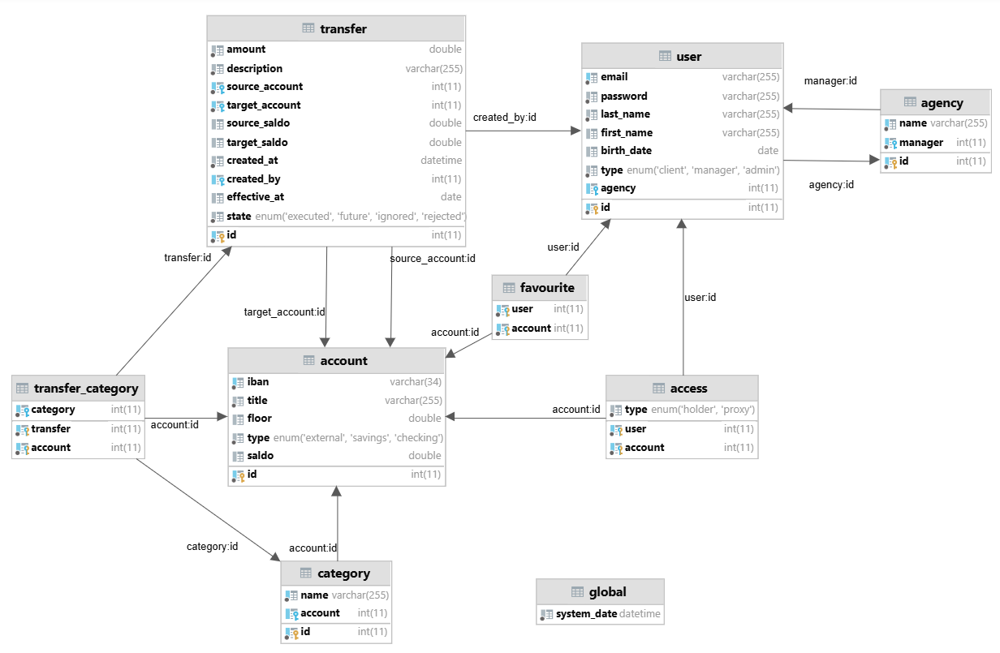
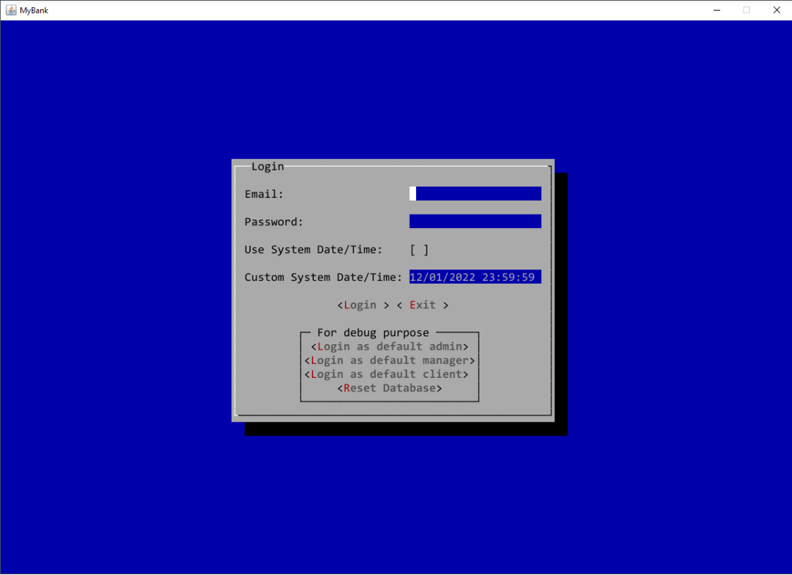
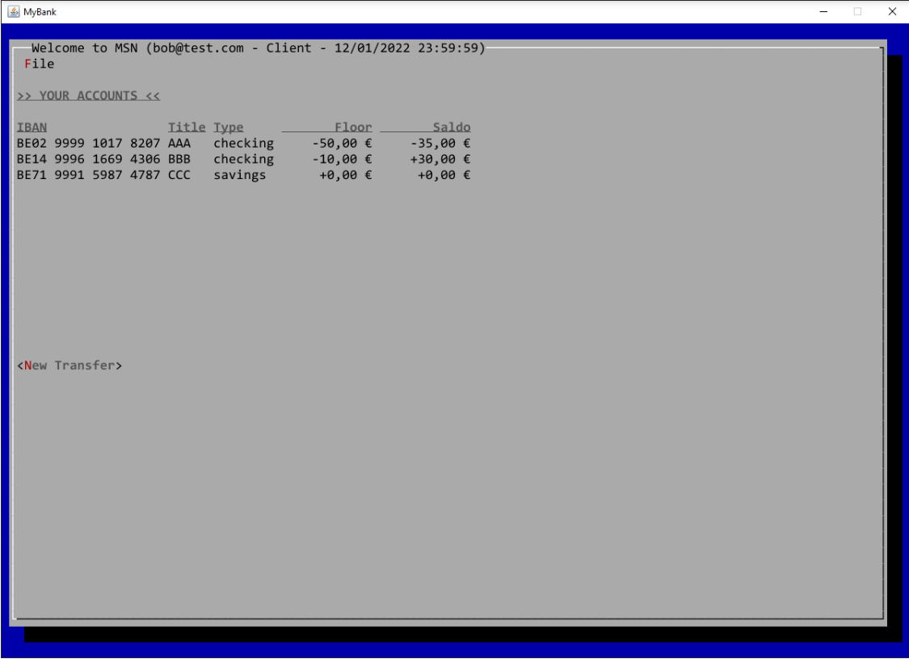
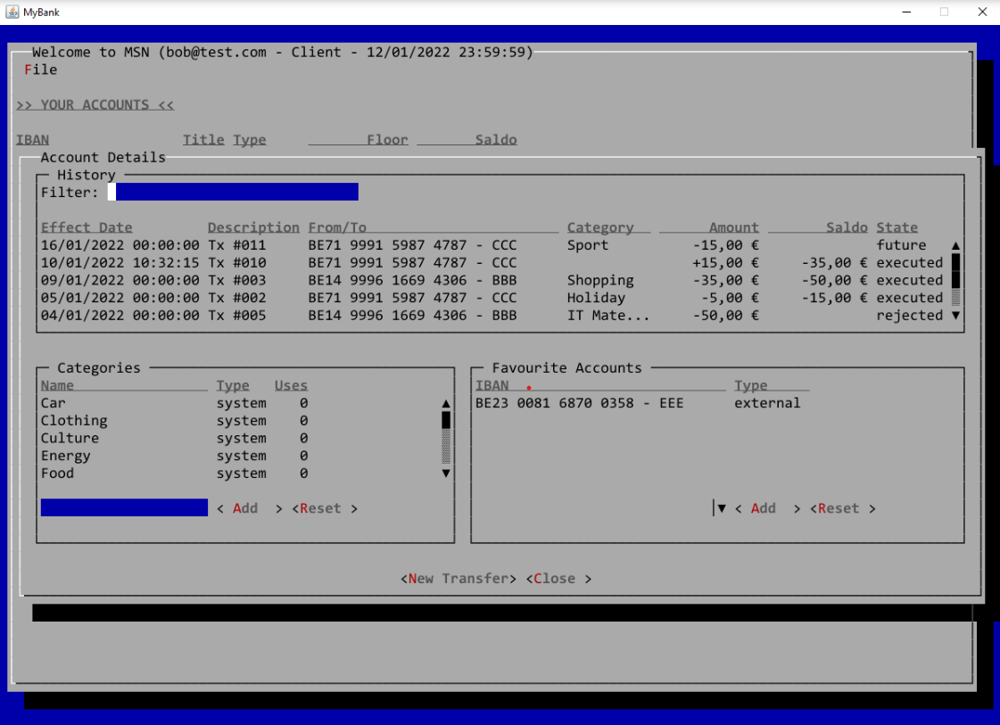
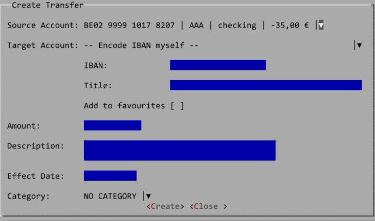
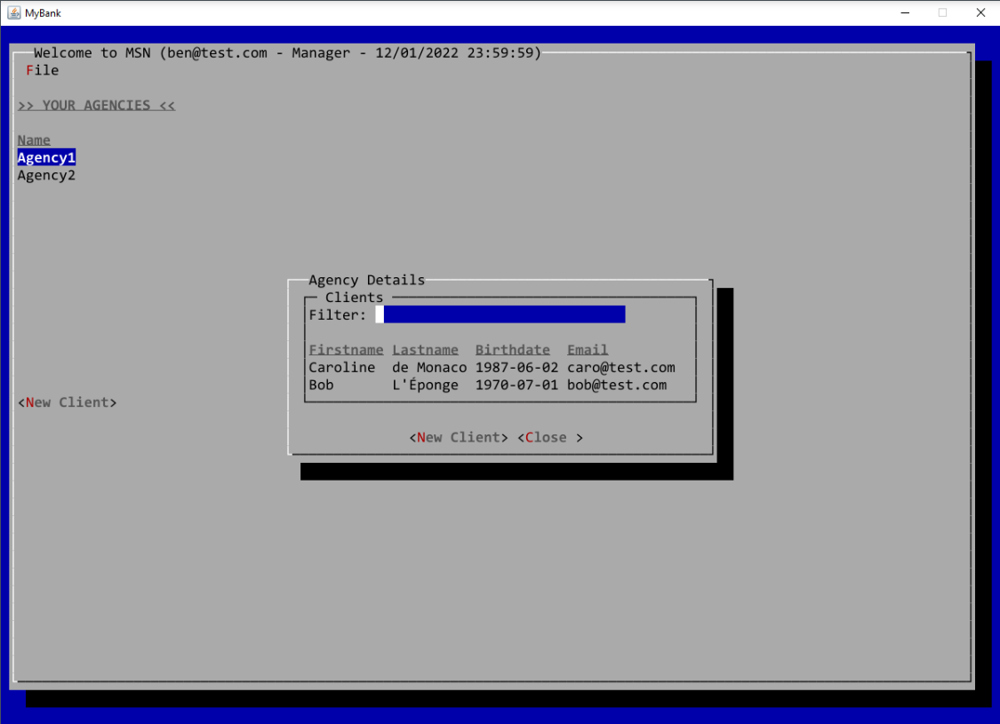
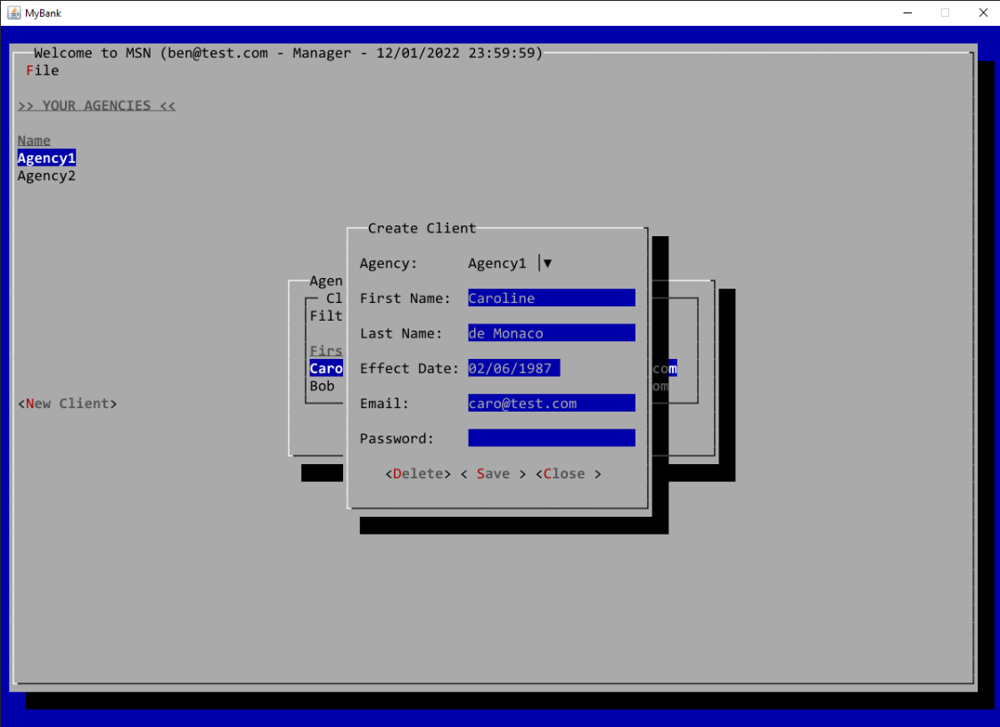

# Banking Application
Desktop application for Client, Account, and Agency Management

## Technologies
  * Lanterna library (JAVA)

## Architecture
  * MVC	

## User list

* test-case:{
  * email:bob@test.com
  * password:bob
  * role:client
  
  * username:ben@test.com
  * password:ben
  * role:manager
 }

## Divers
  
  * DB:{
  	* db.user=root
	* db.password= root or empty
  }

## App

### Database class diagram

### Login and BackToTheFuture

The purpose behind this is to allow users, upon logging into the application, to freely define the current date and time within the app. This custom date and time are independent of the computer's system clock, enabling users to set it to any point in the past or future. The goal of this feature is to simplify testing by allowing users to effectively "travel through time" 😉.

When launching the application, on the login screen, the user can choose one of two options:

Use the system date and time (from the computer's clock).
Manually set a fixed date and time.
In the first option, the application operates in "real-time." This means actions like recording the creation date of transfers will use the computer's current date and time, which updates continuously.
In the second option, time is frozen at the user-defined date and time, remaining fixed.
A logical side effect of this second option is that, since the present time is defined by the user, any transfers in the database with a creation date/time later than this defined present must be removed. Otherwise, they would belong to the "future," and our application isn’t designed to handle future data!

### Client
#### AccountList

#### AccountDetails

#### CreateTransfer

### Admin
#### AgencyDetails

#### CreateClient
